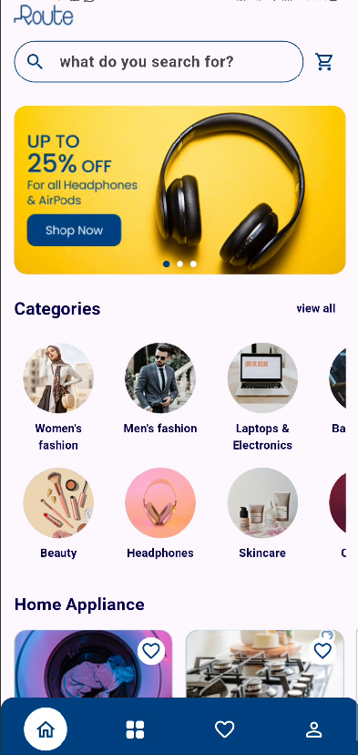
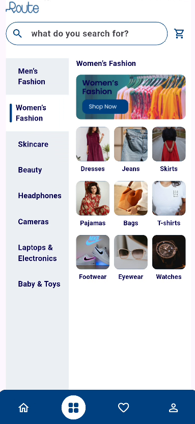
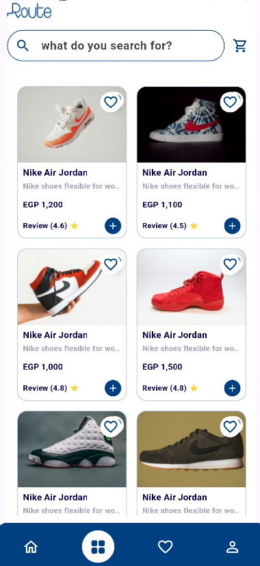
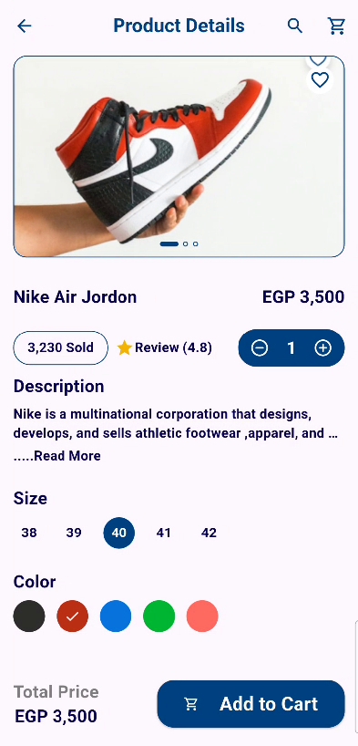
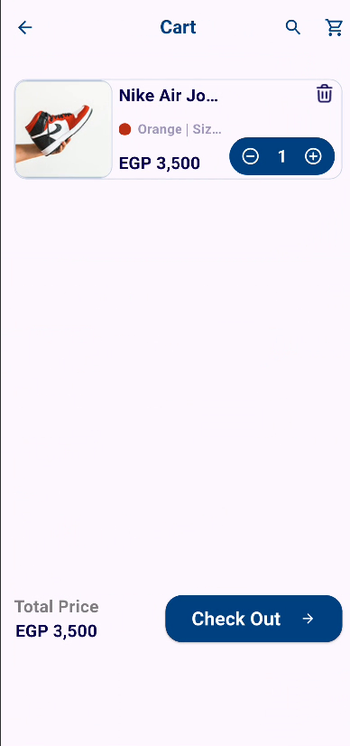
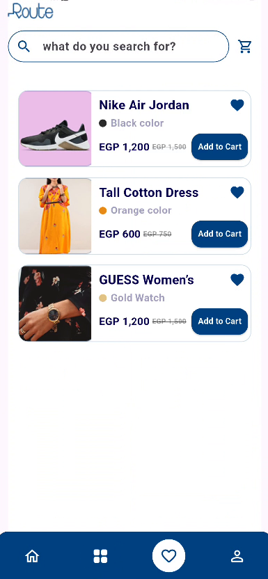
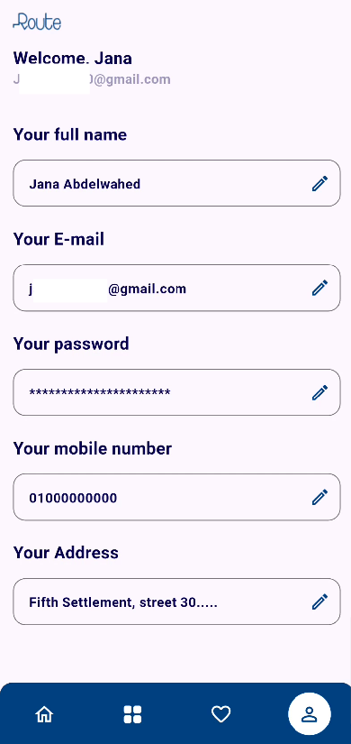

# Route E-Commerce Application

A modern, highly responsive e-commerce application built with Flutter using clean architecture principles and robust state management via BLoC/Cubit. The application features a dynamic product system, categorized browsing, full text search, wishlist, cart controls, and authorization screens.

---

## 📸 Screenshots
        
 

## Technical Architecture & State Management

- **State Management**: Implements `flutter_bloc` with optimized Cubits (`AuthCubit`, `CartCubit`, `WishlistCubit`) to guarantee predictable decoupled states.
- **Dependency Injection**: Powered by `get_it` for decoupling interfaces, data repositories, and remote data sources.
- **Clean Architecture Layers**:
  - **Presentation**: Screen layouts, standalone reusable widgets, app-bars, text styles, forms, and custom animation controllers.
  - **Domain**: Use Cases and abstraction entities.
  - **Data**: Data source implementations, API payload response models, and data mapper mappings.

## Project Structure

```
lib/
│
├── core/
│   ├── constant/      # Assets, Route mappings, Color configurations, and Global styles.
│   ├── di/            # Dependency Injection service locator configurations.
│   └── widgets/       # Global application custom widgets, Search Delegate, and App-bars.
│
└── feature/auth/
    ├── data/          # Remote api endpoints, serializers, models, and repositories.
    ├── domin/         # Business Use-cases and base contracts.
    └── presention/    # Cubits, Screen layout interfaces, and localized components.
```

---

## 🛠️ Tech Stack

* **Framework:** [Flutter](https://flutter.dev/) (Dart)
* **Screen Responsiveness:** `flutter_screenutil`
* **UI Components & Icons:** Material Design & Custom Vectors
* **State Management:** Provider / Clean Architecture Patterns

